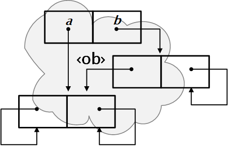
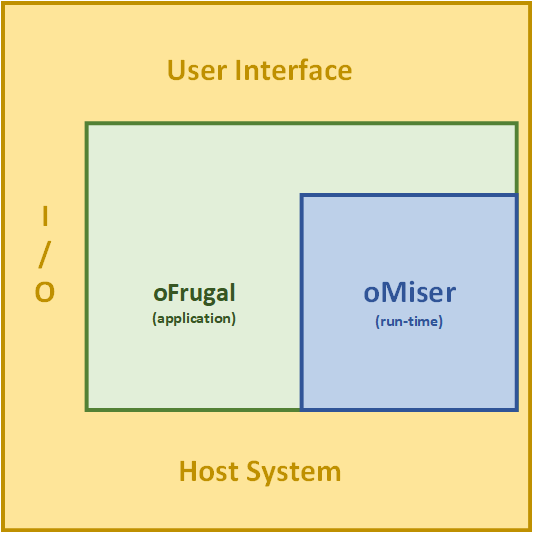

<!-- index.md 0.1.14                UTF-8                         2023-09-08
     ----1----|----2----|----3----|----4----|----5----|----6----|----7----|--*
     source <https://github.com/orcmid/miser/blob/master/docs/index.md>
     construction structure, manifest, and job jar at
     <https://orcmid.github.io/miser/docs.txt>
     -->
# The Miser Project on GitHub

| ***[miser](.)*** | ***[Work-in-Progress](docs.txt)*** | ***0.1.14 2023-09-08*** |
| :--                |       :-:          | --: |
| |  | |

> [**Computation Theory Made Demonstrable**](https://github.com/orcmid/miser)

The Miser Project computational model has two important qualities:

- simplicity, using a small number of concepts that take the covers off
  the power of digital abstraction in exchange for more effort in operational
  usage, akin to working in machine language to accomplish anything

- novelty and unfamiliarity, interrupting what might be already-known or
  assumed about computers, programming and programming languages

If not already, become comfortable with theoretical approaches.  Embrace a
different kind of math, one based on symbolic logic.  Tolerate the degree of
rigor; it is informally formal and doesn't have to be swallowed whole.

- [The Miser Project on GitHub](#the-miser-project-on-github)
  - [1. Taking a Look](#1-taking-a-look)
    - [1.1 Abstraction](#11-abstraction)
    - [1.2 Theory](#12-theory)
    - [1.3 Computational View](#13-computational-view)
  - [2. The Project](#2-the-project)
  - [3. The Software](#3-the-software)
  - [4. Background](#4-background)
  - [5. Available Materials](#5-available-materials)
  - [6. Development](#6-development)
    - [6.1 Principles](#61-principles)
    - [6.2 Future Prospects](#62-future-prospects)

## 1. Taking a Look

### 1.1 Abstraction

The diagram depicts a fundamental entity of the Miser Project model of
computation: a member of the abstract structure, ‹ob›.

- The entities are called *obs* and they can be visualized as *pairs*, each
  having an *a*-part and a *b*-part. The two parts of of a pair are themselves
  obs. Any ob may be a pairing of obs in this manner.

- An *individual* has both the *a*-part and *b*-part be the ob itself.  The
  lowest component in the figure is an individual.  It is complete unto
  itself.  There are any number of distinct individuals.

- An *enclosure* has only the *b*-part be itself.  The middle component in the
  figure is an enclosure.  As an ob, it consists of itself and the *a*-part
  taken together as a whole.

- Similarly, the top component of the figure is a plain pairing.  As an ob,
  it consists of the pairing and the *a*-part and *b*-part taken together.

- There is no limit on such compositions of obs except that
  - no ob is part of its own composition in any other manner, and
  - every composition is finite

- Obs are distinguishable by their composition and the differentiation of
  individuals.

### 1.2 Theory

The Miser Project is very much about computational interpretation of abstract
entities, with mathematical-logic theory as guidance toward
dependable computational interpretations.  The importance of logic to
computer sciences is demonstrated.

Ob diagrams are props in the same manner as rulers,
compasses and pencils on paper are useful in the understanding of Euclidean
Geometry and numerals and arithmetic are helpful in the understanding of
algebra (or vice versa).  In our time, computer programs can serve similar
purposes, so long as the programs are not confused with the abstractions.

Theoretically, obs are entirely abstract
mathematical entities.  In this sense, obs arise only in language and there
is no direct concrete existence, no existence in reality.
The Miser computational model is achieved with introduction of a universal
computational function -- an abstraction still.

### 1.3 Computational View

The diagram is also suggestive of a possible implementation of the ‹ob›
computational model.

- Computer implementations can employ computer data
  structures where the *a*-parts and *b*-parts are addresses of ob
  representations in computer memory.

- Computational forms are immutable and without any cycles via separate
  parts, all in accordance with the mathematical formulation.

- In this perspective, the represented obs are building blocks of
  computational data structures.

For practical computations, a greater variety of data forms is desirable. In
the case of ‹ob› alone, that convenience is deferred.  Focus is on
how the stored-program model and conventional computers afford elevation of
abstraction already.

Management of a computer implementations
will become more elaborate than the simple structure suggested in the diagram.
The diagram remains descriptive as a visualization.

## 2. The Project

The Miser Project provides operational demonstration of computation-theoretic
aspects of software.  Emphasis is on the stored-program principle and the
manner in which computational representation of "higher-order" structures
and types of entities emerge from the ‹ob› foundation.

Achievement of the Miser Project is the career capstone project of the author.
Miser is the outgrowth of a 60-year inquiry into applicative-programming
languages and their theoretical foundations.  The operational program is
intended for the insights it provides and the fundamentals it demonstrates
rather than practical application.

- Miser is thoroughly defined using mathematical-logic formalisms.  The
  applicability of logic in computer science and software development is
  honored and demonstrated throughout.

- Run-time *oMiser* operation demonstrates computational interpretation of the
  mathematical structure, ‹ob› = 〈Ob,Of,Ot〉and its universal function
  **ap** and companion **eval**.  The *o-name* form emphasizes the limitation
  to ‹ob› and only obs.

- The interface language, *oFrugal*, is defined with a formal grammar having
  semantics defined in terms of ‹ob› functions, providing a complete
  specification.  Connection between formal semantics and the syntactical
  structure of programming languages is demonstrated in this direct case.

- Ability of the stored-program concept to elevate levels of
  computational abstraction along with emergence of other types of
  data/operation is demonstrated in a tangible manner with careful reusable
  constructions.

## 3. The Software

The production/reference *oMiser* run-time is intended for use by other
software.  It has portable implementations that operate on
general-purpose computer platforms as a library to other programs on the
platform.

The interplay of implementation and theoretical foundations is accomplished in
layers.

*oMiser* run-time is purely algorithmic/procedural in
nature.  It supports expression of a rudimentary data structure and
algorithmic procedures on that structure.  The expression of algorithms is via
an applicative-function interpretation of data taken as scripts.  In
software-engineering terms, this is the model side of an interactive computer
application.

.

The accompanying *oFrugal* software embeds an *oMiser* run-time and delivers
access to *oMiser* via the host-platform user interface.  *oFrugal* provides
for input-output and carrying out of *oMiser* computations in accordance with
direct input and/or previously-stored scripts.  The commanding of *oFrugal*
operation is known as a REPL (read-evaluate-print-loop) arrangement.
It is appropriate to regard *oFrugal* as an ‹ob› calculator.

*oFrugal* provides expression of data and results in a visible and
persistent form, known as **Frugalese**.  *oFrugal* reference formats
are usable in portable interchange of programs and data.

## 4. Background

(TBD: some ideas, including Rosenbloom. A specific bibliography will be used.)

*oMiser* represents procedures and data in the same data format, demonstrating
the essence of the stored-program concept.  Inspiration is from formulation of
LISP, although Miser is not LISP.

Applicative operation is inspired by work of Peter Landin,
Christopher Strachey, and other ideas about functional programming connected
to combinatory logic and the λ-calculus.

*oMiser* lacks input-output and any kind of filing system for reusable
artifacts, whether data or applicative-expression scripts.  In this respect,
there are similarities to the formulation of Functional Programming by John
Backus.  The operational "system" layer, *oFrugal*, provides storage and
utility functions.  The *oMiser* layer provides a computational model
of the ‹ob› mathematical structure.

## 5. Available Materials

(TBD: various resources and links to them, including the bibliography)

## 6. Development

- Important milestones include

  - establishment that Miser provides an effective representation of the
    computable functions under the Church-Turing thesis

  - demonstration of how such a mechanism is itself amenable to mechanizing
    logical deductions and theorem proving

  - introduction of accelerators that improve operation entirely within the
    inherent computational complexity of the approach.

### 6.1 Principles

- Development is supported by narrative and reference materials, with
  important attributions to sources, at all times.

- Proof-of-concept demonstrations and releasable software are developed
  with freely-available and free-to-use development tools.  The project
  is conducted entirely with code in the open and the work is free to use and
  to adapt with appropriate attribution.

- The *oFrugal* REPL shall be provided as a simple standalone command-line
  program fully usable in conjunction with a text editor for creating scripts.

### 6.2 Future Prospects

The refinement of oMiser and oFrugal mockups toward conventional-computer
production code is a kind of bootstrapping spiral. Once there is a stable
*oFrugal* REPL, more-ambitious extensions are aspired to.  There are no
concrete provisions at this time.

- Expanding to additional levels of Miser engines that extend to operation
  over multiple forms of data, representation of mutable state, and
  input-output including interaction and distributed operation.

- Expansion to additional levels of Frugal front-ends to provide higher-level
  programming-language support and compilation of programs into distributable,
  directly-usable forms on general-purpose computers such as Windows PCs.

- Enrichment of Miser to the point where the  engine is capable of having
  Frugal as a Miser application, rather than as a
  surrounding host-system application.  The appearance to users can be the
  same, whether or not the performance is as responsive.

- In the other
  direction, the bonus challenge is having Miser able to compile Miser
  applications down to direct operations on the host platform in a dependable
  and disciplined manner.

It may become necessary to take one more run at
[computational monads](https://en.wikipedia.org/wiki/Monad_(functional_programming))
and embrace some
[Category Theory](https://en.wikipedia.org/wiki/Category_theory)
although some
[Computational Logic](https://www.cs.utexas.edu/users/moore/acl2/) equivalent
may need to tag along with that.

----

I invite discussion about Miser Project topics in the
[Discussion section](https://github.com/orcmid/miser/discussions).
Improvements and removal of defects in this particular documentation can be
reported and addressed in the
[Issues section](https://github.com/orcmid/miser/issues).  There are also
relevant [projects](https://github.com/orcmid/miser/projects?type=classic)
from time to time.

<!--

  0.1.14 2023-09-08T16:23Z More smoothing of the front parts
  0.1.13 2023-09-07T19:11Z Still more wordsmithing
  0.1.12 2023-09-05T21:07Z More smoothing of the early parts
  0.1.11 2023-09-04T22:15Z Smooth the narrative, topped by brief synopsis
  0.1.10 2023-09-01T19:41Z Fix pesky indentation/title-level problem
  0.1.9 2023-09-01T18:54Z Corrections touch-ups
  0.1.8 2023-09-01T17:39Z Added TOC, more narrative for stage-setting
  0.1.7 2023-08-30T00:09Z Smoothing, opening the layout with lists
  0.1.6 2023-08-25T15:04Z Smoothing and aligning the version number
  0.1.5 2023-08-24T03:35Z Expand the first topic and update section numbers
  0.1.4 2023-08-22T21:18Z Tidy up the initial paragraphs
  0.1.3 2023-08-19T20:28Z Top-up with explanation of the diagram
  0.1.2 2023-08-19T03:03Z Correct image location once more
  0.1.1 2023-08-19T01:45Z Correct (larger) image location
  0.1.0 2023-08-19T00:43Z Transpose the README here as a better exposition
  0.0.8 2023-08-18T19:13Z Expand, focusing on status and forthcoming refactor.
  0.0.7 2023-08-15T20:27Z Simplification, linking to README and .txt files.
  0.0.6 2023-08-14T22:56Z twiddling
  0.0.5 2023-08-14T22:03Z change location of the image, simplify a bit
  0.0.4 2019-11-20 placeholder remarks

               *** end of docs/index.md ***                           -->
