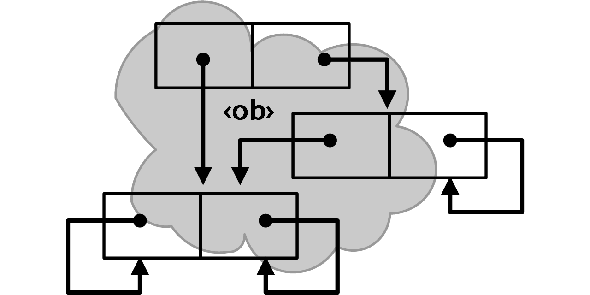

<!-- index.md 0.0.4                UTF-8                     dh:2019-11-20 -->
<!--|----1----|----2----|----3----|----4----|----5----|----6----|----7----|-->
<!-- source <https://github.com/orcmid/miser/blob/master/docs/index.md>
     construction structure, manifest, and job jar at
     <https://orcmid.github.io/miser/docs.txt>
     -->
# The Miser Project on GitHub

> [**Demonstrating Computation Theory Made Practical**](synopsis/)

This space is under construction.  This page will become the home page for
The Miser Project documentation on GitHub.

It is an experimental employment of GitHub Pages at `master/docs/` to see
whether the documentation and blogging needs of the project can be met here
with minimal fuss.

The published form of the pages is at <https://orcmid.github.io/miser/>

Notes on the plumbing within the structure are found at pages such as
[docs.txt](docs.txt).  Such markdown pages are moved intact to the published
form.

The footer, offering page improvement (and presumably requiring a push
request) is maybe not what I had in mind.  It requires logging into GitHub.

An important feature of the default (i.e., none-specified) theme is that
reflow on change of browser view width is automatic and as desired.

I do have some concerns about explicit versioning and having content that
is skipped.  I can specify HTML comments for that, and I am doing so.

We will run through all of the Markdown options to see how they are
rendered here.  Theme demos provide a nice comparison.

Demonstration of the current theme, including the markdown elements, is
at [current](construction/current/) here.

Placeholder initiated 2019-11-20T08:37
Construction structure at <https://orcmid.github.io/miser/docs.txt>
<!--
     -->
<!--                *** end of docs/index.md ***                           -->
