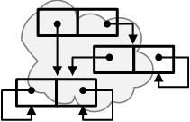

<!-- index.md 0.3.7                 UTF-8                         2024-12-22
     ----1----|----2----|----3----|----4----|----5----|----6----|----7----|--*
     source <https://github.com/orcmid/miser/blob/master/docs/lambda/index.md>
     publication <https://orcmid.github.io/miser/lambda/>
     -->
<table border="0" width="100%">
  <tr>
    <td width="25%" align="left" height="6">
       <a href="../" title="The Miser Project on GitHub">
       </a>
    </td>
       <td width="48%" height="6"><p align="center"><font color="#990033"><strong>
	<i>The Miser Project</i><br />
    <i><big><big>λ Applicative-Procedure Abstraction</big></big></i></strong></font></p>
    </td>
    <td width="27%" height="6" valign="middle" align="right">
      <b><code>
	  <a href="../" target="_top">miser</a>&gt;
      <a href="./" target="_top">obap</a>&gt;
      </code></b>
      <br /><br />
      <a href="https://clustrmaps.com/site/1bw9w" title="Visit tracker">
            
      </a>
      <br /><br />
      <b><code>
         <a href="index.html" target="_top">index</a>&gt;</code></b>
      <br />
      <small><small>
        0.3.7 2024-12-22T17:41Z<!-- MAINTAIN THIS MANUALLY -->
      </small></small>
      </td>
  </tr>
</table>

## 1. The Abstraction Idea

| Views on Abstraction |
| --- |
| "This process \[of extracting common features\] can be regarded as a repeated abstraction ... and under certain circumstances such abstracting processes can be repeatedly piled on top of one another.  Here '_abstract_' has to be understood in the literal meaning of the word as 'removing', as leaving aside everything inessential for the context in question or for a particular purpose ... ." |
| -- [Hans Reichardt](https://mathshistory.st-andrews.ac.uk/Biographies/Reichardt/) \[[VNR1977](https://orcmid.github.io/bib/authors.htm#VNR1977): Introduction,p.11\] |
|  |
| "A high-level computer language _abstracts away the machine_ \[so that\] the programmer need not be an expert in the machinations of computer hardware ... in order to successfully program a computer.  High-level languages (HLLs) automate, hide, or otherwise abstract away the underlying operations of the machine ... ." |
| -- Mark Jones Lorenzo \[[Lorenzo2019](https://orcmid.github.io/bib/progsys.htm#Lorenzo2019): Introduction, p.13\] |
|  |
| "Abstraction is about digging deep into a situation to find out what is at its core making it tick.  Another way to think of it is about stripping away irrelevant details, or rather, stripping away details that are irrelevant to what we're thinking about." |
| -- [Eugenia Cheng](https://en.wikipedia.org/wiki/Eugenia_Cheng), _The Joy of Abstraction_ \[[Cheng2023](https://orcmid.github.io/bib/math.htm#Cheng2023): 2.3 Forgetting Details\] |
|  |
| "We call the symbol λx an _abstraction operator_, and speak of the function which is denoted by (λx _M_) as obtained from the expression _M_ by _abstraction_." |
| -- [Alonzo Church](https://en.wikipedia.org/wiki/Alonzo_Church) \[[Church1941](https://orcmid.github.io/bib/logic.htm#Church1941): p.7\] |

## 2. The Abstraction Challenge

The challenge at the oMiser/oFrugal level is the fact that there are _only_
obs and _every_ ob has an applicative interpretation; _any_ ob can have an
intended operational use as both data and script.  The computational
accomplishment of abstraction for oMiser straddles that ambiguity/flexibility
of interpretation.

### 2.1 Pure abstraction

Pure abstraction operations on obs depend on an ob and its structure without
consideration of anything other than the ob "as-is."  The abstraction `σ.s M`
is a script for a function such that `(σ.s M) N` determines a form of `M` with
`N` substituted everywhere `s` occurs in `M`.  This is based strictly on ob
structure and not on any applicative interpretation of `M`.

Although `σ.s M` determines an ob, that ob has no occurrences of `s`.  In this
sense, `σ.s M` has `s` abstracted away; `(σ.s M) s` determines `M` as-is.

There are handy companion functions, `δ(s, N)` and `subst(N, s)`, for use in
particular circumstances, often when one or more particular operands are known
in advance.

```ML
δ(s, N) M = subst(N, s) M = (σ.s M) N = σ(s, M, N)
```

also illustrating various Frugalese forms for achieving the same result.

These and their intermediate variations, such as `subst(.ARG)`, known as
Curried forms, will be employed in the development of oFrugal utility scripts.

### 2.2 Symbolic forms

Symbolic forms are obs having the appearance of applicative expressions and/or
constant list structures.  Intended interpretations for them are not
self-evident, however suggestive the form might be.  Purpose for a symbolic
form is revealed only in the context of its usage.

The harmony of symbolic form and applicative-expression, when that
interpretation is the case, is encouraged by the computational interpretation
of `f :: g :: x` being tantamount to the Frugalese applicative expression
`f g x`, both being right-associative and equivalent to `f(g x)` were the
lindies `f`, `g`, and `x` taken to be variables for appropriate obs.

The oFrugal definitions of applicative-procedure abstraction rely on that
structural nicety, transforming symbolic forms into applicative-function
scripts in a manner that supports confirmation of correct operation.

#### 2.2.1 Symbolic-form preservation

When a symbolic form is evaluated or applied directly, the symbolic
form is preserved.

For example, the oFrugal expression

```ML
(a x) b x ;
```

evaluates to

```ML
(a :: x) :: b :: x ;
```

and

```ML
!eval (a :: x) :: b :: x ;
```

the same.  This hinges on the mathematical engineering by which scripts such
as `!eval x :: y` with lindies `x` and `y` are evaluated as `obap.ap(x,y)`
with result `x :: y` in accordance with the distinguishing of symbolic forms
in the [definition of obap.ap](../obap/obaptheory.txt).

#### 2.2.2 Rules of symbolic-form structure

The oMiser computational model's application function treats lindies as
individuals having no definable/separate applicative interpretations.

Lindies are taken as individual symbolic forms.

When application operator `p` and operand `x` are both symbolic forms, the
result of application is the composed symbolic form `(p) :: x`.

When `p` is a symbolic form, `(p)::.NIL` is a symbolic form.  Otherwise
when only `p` is a symbolic form, the result of application is `(p) :: ‵ x`,
itself a symbolic form even though `x` may be an ob of any form.

As is done in the examples (2.2.1, above), symbolic forms are usually written
in canonical form, omitting unnecessary parentheses.

## 3. Functional Abstraction Heuristics

\[Author's Note\]: Brief introduction to the two forms.

## Catalog (Specimen, LYYMMNN Content TBD)

This placeholder links to raw materials and notes, including text files.
There will be organized folios of content as consolidation of documentation
on the web progresses.

| **ID**                  | **Status** | **Started** | **Topic** |
|   :-:                   |   :-:      |  :-:        |  ---      |
| [sigma](oSigma.txt)    | 0.4.0 2024-06-24 | 2024-05-05 | `σ.s M`, `subst(L, s)`, `δ(s, L)` definitions |
| [lambda](oLambda.txt)   | 0.4.0 2024-06-24 | 2024-06-20 | `λ.x` & `ρ.p` Abstraction Operations |
| [c000000](c000000.htm)  | undated    | 2024-01-25  | Construction Diary & Job Jar |

----

I invite discussion about Miser Project topics in the
[Discussion section](https://github.com/orcmid/miser/discussions).
Improvements and removal of defects in this particular documentation can be
reported and addressed in the
[Issues section](https://github.com/orcmid/miser/issues).  There are also
relevant [projects](https://github.com/orcmid/miser/projects?type=classic)
from time to time.

<table border="0" cellspacing="3" width="100%">
  <tr>
    <td width="14%">
	<a href="index.htm" target="_top">
       
       </a>
    </td>
    <td width="54%" valign="middle" align="center">
      You are navigating the <a href="../">Miser Project on Github</a></td>
    <td width="30%">
      <p align="right"><font size="-2">created 2024-01-25 by
         <a target="_top" href="../../orcmid">orcmid</a> </font></p>
    </td>
  </tr>
</table>
<!--

  0.3.7  2024-12-22T17:41Z Tie in obaptheory.txt symbolic form treatment
  0.3.6  2024-12-21T22:25Z You are trapped in a twisty symbolic form with
                           intrpretations all the same
  0.3.5  2024-12-21T17:51Z Enough fussing with Symbolic Form for now
  0.3.4  2024-12-18T22:53Z Still struggling with Symbolic Form motivation
  0.3.3  2024-12-15T23:29Z Smooth 2.2 more
  0.3.2  2024-11-28T17:39Z Touch up 2.1 a bit more
  0.3.1  2024-10-28T19:47Z Touch up 2.2
  0.3.0  2024-10-28T18:04Z Complete 2.2 on Symbolic Forms
  0.2.13 2024-09-03T15:42Z Cleanup 2.1
  0.2.12 2024-08-31T23:13Z Continue on 2.2 Symbolic Expressions
  0.2.11 2024-08-29T18:33Z Expand 2.1 on Pure Abstractions
  0.2.10 2024-08-19T19:46Z Backup of intermediate draft on abstraction
  0.2.9  2024-08-08T18:05Z Introduce maebe and start normalizing abstraction
         notation
  0.2.8  2024-07-17T16:11Z Link to Eugenia Cheng Wikipedia
  0.2.7  2024-07-16T17:07Z Add quote from Eugenia Cheng, Joy of Abstracktion
  0.2.6  2024-07-16T16:09Z Add link to Church Wikipedia article
  0.2.5  2024-07-15T00:53Z Fix italic M in Church quotation
  0.2.4  2024-07-14T19:49Z Add Church1941 quotation
  0.2.3  2024-07-13T17:14Z Add Lorenzo2019 quotation
  0.2.2  2024-07-13T15:39Z Repair tabulation for quotations
  0.2.1  2024-07-12T21:11Z Try using a table for quotations layout
  0.2.0  2024-07-12T16:54Z Begin draft text
  0.1.0  2024-07-01T20:08Z oSigma and oLambda introduction
  0.0.0  2024-01-25T17:26Z Placeholder from 0.0.2 obap/index.md boilerplate

               *** end of miser/docs/lambda/index.md ***                  -->
