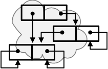

<!-- m010500.md 0.0.0               UTF-8                         2026-03-08
     ----1----|----2----|----3----|----4----|----5----|----6----|----7----|--*
     source <https://github.com/orcmid/miser/blob/master/docs/obapx/index.md>
     publication <https://orcmid.github.io/miser/obapx/>
     -->
<table border="0" width="100%">
  <tr>
    <td width="25%" align="left" height="6">
       
    </td>
    <td width="48%" height="6" align="center" valign="middle">
       <strong>
	   <i><a href="../../index.html#related-material">
       oMiser Technical Note m010500
       </a></i> 
       <i><big><big>oMiser Iob Interface</big></big></i>
       </strong>
    </td>
    <td width="27%" height="6" valign="middle" align="right">
      <b><tt>
      <a href="../../../../" target="_top">orcmid.github.io</a>&gt;
      </tt></b>
       
       
      <b>
      <a href="../../../" target="_top">miser</a>&gt;
      <a href="../../" target="_top">oMiser</a>&gt;
         
         <a href="m010500.html" target="_top">m010500</a>&gt;</b>
       
      <small><small>
        0.0.0 2026-03-08T01:25Z<!-- MAINTAIN THIS MANUALLY -->
      </small></small>
    </td>
  </tr>
</table>

\[AUTHOR NOTE\]  A Placeholder with BoilerPlate from Another Topic
- [1. Buckets, Entries, Items, and Interfaces](#1-buckets-entries-items-and-interfaces)
- [2. Services of the MOb Interface](#2-services-of-the-mob-interface)
- [3. Linear Hashing](#3-linear-hashing)
- [4. MOb Operation Considerations](#4-mob-operation-considerations)
- [Related Material \[TBD\]](#related-material-tbd)

## 1. Buckets, Entries, Items, and Interfaces

## 2. Services of the MOb Interface

## 3. Linear Hashing

## 4. MOb Operation Considerations

## Related Material [TBD]

| **ID**                    | **Status**   | **Started** | **Topic**         |
|   :-:                     |   :-:        |  :-:        |  ---              |
|                           |              |             |                   |
| [m110400a](m110400a.htm)  | undated      | 2025-11-16  | Diary & Job Jar   |
| [m110400b](m110400b.html) | 0.0.2 2026-02-24 | 2025-11-16 | Linear Hashing   |
| [m110400b1](m110400b1.pdf)| preservation | 2011-04-21  | LwNet Discussion  |
| [m110400b2](m110400b2.pdf)| preservation | 1980-10     | [Litwin1980](../../../../bib/authors#Litwin1980) |
| [m110400c](m110400c.html) | 0.0.2 2026-02-27 | 2026-02-25  | MOb API           |

----

I invite discussion about Miser Project topics in the
[Discussion section](https://github.com/orcmid/miser/discussions).
Improvements and removal of defects in this particular documentation can be
reported and addressed in the
[Issues section](https://github.com/orcmid/miser/issues).  There are also
relevant [projects](https://github.com/orcmid/miser/projects?type=classic)
from time to time.

<table border="0" cellspacing="3" width="100%">
  <tr>
    <td width="14%">
	
    </td>
    <td width="54%" valign="middle" align="center">
      You are navigating the <a href="../../../">Miser Project on Github</a></td>
    <td width="30%">
      
created 2026-03-08 by
         <a target="_top" href="../../../../orcmid">orcmid</a> 

    </td>
  </tr>
</table>
<!--

  0.0.0  2026-03-08T01:25Z Placeholder

               *** end of oMiser/2001/05/m010500.md/ ***                  -->
