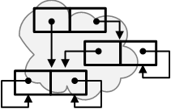

<!-- m120400b.md 0.0.0              UTF-8                         2025-11-21
     ----1----|----2----|----3----|----4----|----5----|----6----|----7----|--*
     publication: <https://orcmid.github.io/miser/2012/04/m120400.html>
     -->
<table border="0" width="100%">
  <tr>
    <td width="25%" align="left" height="6">
       
    </td>
       <td width="48%" height="6">
<strong>
	<i><a href="../../m000001.htm#m120400">oMiser Technical Note m120400b
    </a></i> 
    <i><big><big>MobPack XML Format</big></big></i></strong>

    </td>
    <td width="27%" height="6" valign="middle" align="right">
      <b><tt>
      <a href="../../../../" target="_top">orcmid.github.io</a>&gt;
      </tt></b>
       
       
      <b>
      <a href="../../../" target="_top">miser</a>&gt;
      <a href="../../" target="_top">oMiser</a>&gt;
         
         <a href="m120400b.html" target="_top">m120400b</a>&gt;</b>
       
      <small><small>
        0.0.0 2025-11-21T01:31Z<!-- MAINTAIN THIS MANUALLY -->
      </small></small>
      </td>
  </tr>
</table>

## Placeholder

This will be populated from (#68.9-10 and links from there).

This is strictly about the XML format that we are after.  The idea is that it
provide a kind of reverse-Polish loading scheme with preservation of multiple
links to the same ob-cell.

This might not be appropriate for quick-saving and loading as if from backups.

The use of an OPC/ODF Package with compression and possible signing/encryption
is also of interest in a persistent form.

Those options might be separate.  The key feature that has to be established
is creating a topological sorting that has an ob-cell established prior to
all cells that refer to it and also provides a tag that all but the chosen
one can use to refer to it.  This should work without forward references, if
not too hard.  Or maybe we take our chances with program points.

It's really all up in the air.

----

I invite discussion about Miser Project topics in the
[Discussion section](https://github.com/orcmid/miser/discussions).
Improvements and removal of defects in this particular documentation can be
reported and addressed in the
[Issues section](https://github.com/orcmid/miser/issues).  There are also
relevant [projects](https://github.com/orcmid/miser/projects?type=classic)
from time to time.

<table border="0" cellspacing="3" width="100%">
  <tr>
    <td width="14%">
	
    </td>
    <td width="54%" valign="middle" align="center">
      You are navigating the <a href="../../../">Miser Project on Github</a></td>
    <td width="30%">
      
created 2025-11-20 by
         <a target="_top" href="../../../../orcmid">orcmid</a> 

    </td>
  </tr>
</table>
<!--

  0.0.0  2025-11-21T01:31Z Initial placeholder from hybridForm boilerplate

               *** end of oMiser/2012/04/m120400.md/ ***                  -->
