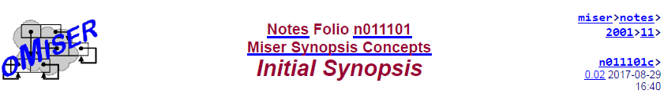
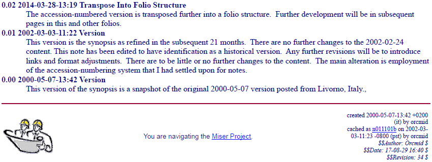

<!-- index.md 0.0.5                UTF-8                     dh:2019-11-22 -->
<!--|----1----|----2----|----3----|----4----|----5----|----6----|----7----|-->
<!-- source: <https://github.com/orcmid/miser/blob/master/docs/synopsis/index.md>
     manifest: <https://github.com/orcmid/miser/blob/master/docs/synopsis/synopsis.txt>
     -->

--------

. **Latest version:** The latest Miser Synopsis presentation is at
  <http://miser-theory.info/notes/2001/11/n011101b.htm>.
. **This page: 0.02 Initial Synopsis**
  <http://miser-theory-info/notes>.  This is the synopsis that has been
  stable for several years and is preserved here as the basis for further
  elaboration.
. **PDF Preservation:**
  <https://orcmid.github.io/miser/synopsis/Miser-0.02-synopsis.pdf>
. **Miser Project Replication**: <https://orcmid.github.io/miser/synopsis/>

 --------

Replicate the text of the PDF/Miser Notes page.

--------

