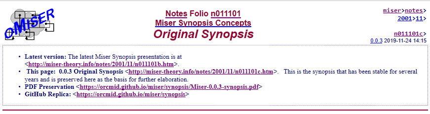
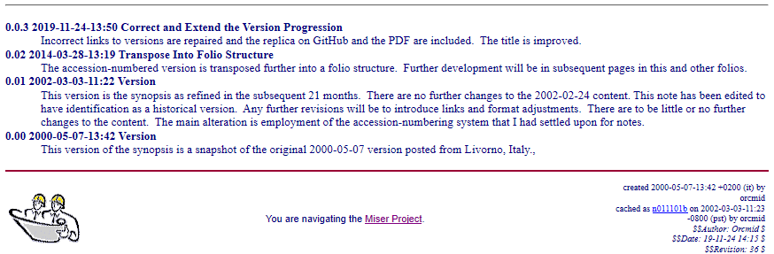

<!-- index.md 1.0.2                UTF-8                     dh:2019-11-24 -->
<!--|----1----|----2----|----3----|----4----|----5----|----6----|----7----|-->
<!-- source: <https://github.com/orcmid/miser/blob/master/docs/synopsis/index.md>
     manifest: <https://github.com/orcmid/miser/blob/master/docs/synopsis/synopsis.txt>
     -->

The Miser Project is a practical exploration of key concepts at the foundation
of computer science.

Project elements demonstrate the fundamental nature and simplicity of
computation.  From that simple foundation, operational implementations of
computer programs are created, at first using a simple processing language
(**Frugal**), that demonstrate the clear possibility of elegant, consistent computational systems of great power based on elementary but rigorous
foundations.

The project begins by formulating and then constructing a simple, well-defined
and easily-analyzed family of computational mechanisms, the **Miser Engines**.
The progression of Miser engines makes clear where gains in power are
available and where the limitations of computation are inescapable.
A key objective is investigation of computational regimes that interact
in/with worlds "outside/beyond" themselves.

The basic data elements of Miser are different from the structures used in
conventional programming systems.  These elements, the
[**Miser Obs**](https://github.com/orcmid/miser/blob/master/oMiser/obtheory.txt), are similar to those of Lisp and other list-processing languages, although
Miser is not Lisp.

This choice of initial elements supports seven project themes:

<dl>
<dt>1. Universality</dt>
<dd>having from the very beginning an elementary structure that is completely
sufficient as a basis for (representing) all computations of any kind</dd>
<dt>2. Completeness</dt>
<dd>providing direct access to and demonstration of the notion of
computational completeness</dd>
<dt>3. Interpretation</dt>
<dd>contrasting with familiar computational entities (and their
representations) so that we can see more clearly what is essential and
what is inessential in the implementation and interpretation of
computational entities</dd>
<dt>4. Representation</dt>
<dd>strengthening our grasp on what it means to represent something in a
computer system</dd>
<dt>5. Extensibility</dt>
<dd>demonstrating a computational system's capacity for integrating extensions
to its internal representations while preserving amenability of the system to
theoretical analysis</dd>
<dt>6. Fidelity</dt>
<dd>confirming an implementation's fidelity to a
<a href="http://miser-theory.info/notes/n001000.htm"> theoretical model</a>
</dd>
<dt>7. Realization</dt>
<dd>mechanizing the mechanism's theoretical model in the computational system
itself</dd>
</dl>

The Miser Project is an activity of independent scholarship, using the Web as
a vehicle for communication and collegial discussion.  Many of the topics are
unfolded as individual web pages and in diaries and notes that become the
annotations and history of the latest thinking reflected in the web pages.
All of the work is available for use and redistribution/publication under a
simple open-source license.

Work on Miser was begun around 1978, but not taken beyond a clumsy prototype
implementation on a Heathkit H8 computer system.  Lately, I began to see how
my perspective has progressed even while I was not thinking about it very
much.  Miser provided me with useful insights into much of what lies mostly
unrecognized and untapped beneath the significant computational power that we
have available today.  This leads me to once again take up Miser and use it
as a vehicle for exploring the heart of computation, computer science, and
computers as linguistic devices.

This work was inspired by what I learned in the company of computer scientists
Bill Burge and [Peter Landin](https://en.wikipedia.org/wiki/Peter_Landin).
It was the unswerving commitment of
[Bob Bemer](https://en.wikipedia.org/wiki/Bob_Bemer) to a vision of software
piece parts and re-usability that brought this particular combination
together.  It opened a new world for me.
[Christopher Strachey](https://en.wikipedia.org/wiki/Christopher_Strachey),
who I had met only briefly, provided a major inspiration.  I am particularly
thankful to having been around for the initial blossoming and flourishing of
[ALGOL 60](https://www.masswerk.at/algol60/report.htm) and the continuing
inquiry into computer science that emerged with that magnificent instrument.

I am indebted to conversations with Alan Camhi for my return to this work.
Alan, this is the beginning that I promised to make.

-- <i>Dennis E. Hamilton Livorno, Italy 2000 May 7
</i>

